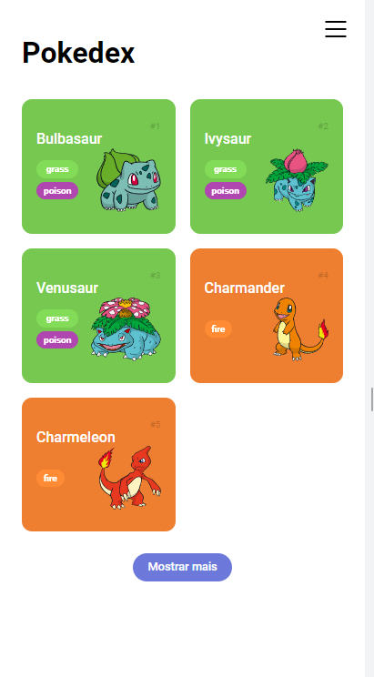

# Pokédex

## Sobre o projeto

Pokédex Desenvolvida com o consumo da API REST [PokéApi](https://pokeapi.co/), utilizando o conceito MobileFirst.

## Tecnologias Utilizadas

- HTML
- CSS
- JavaScript

## Funcionalidades

- [X] Listar conteudo do Json no HTML de maneira dinamica
- [X] Paginação, limitada ao numero de itens maximo da requisição
- [] Menu lateral
- [] Detalhes do Pokemon
- [] Pesquisa por Pokemon

## Como Usar

1. Clone este repositório: `git clone https://github.com/devzanotti/pokedex.git`
2. Navegue até o diretório do projeto: `cd pokedex`
3. Abra o arquivo `index.html` em seu navegador

## Contribuição

Contribuições são bem-vindas! Sinta-se à vontade para abrir uma **issue** ou enviar um **pull request**.

